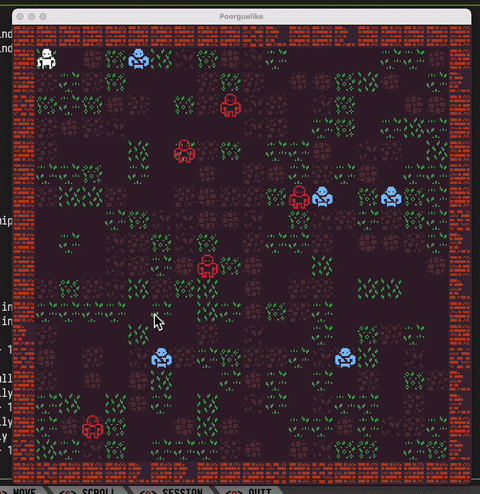

# poorguelike (temporary name, accepting ideas)



This is my first (serious) attempt at both:
- Making a game
- Using Rust

I'm trying to use the least amount of dependencies possible, so for now the only lib I'm depending on is [raylib](https://www.raylib.com/) via [raylib-rs](https://github.com/deltaphc/raylib-rs).

For art is using this great [Kenney](kenney.nl) tileset (I'm not an artist, but I'll probably expand it further if I need more stuff): https://www.kenney.nl/assets/bit-pack

## Installation
Make sure you've got [rust stuff installed](https://rustup.rs/), CMake (on OSX: `brew install cmake`) and then:

```bash
git clone https://github.com/adoroburrito/poorguelike
cd poorguelike
cargo run
```

Tested on OSX, but should work fine on Linux. I'm not sure if Raylib works on Windows, it probably does but I haven't tested.

## Commands
Pressing any button will trigger a game state update (later I'll make it so that only *gameplay* actions do that, and not *HUD* or other stuff, I hate dying when I'm messing around in some obscure menu in a game)

Movement is bound to H, J, K and L *(for now)*

## Motivation

I get bored out of my mind by practicing leetcode/learning algorithm/data structure implementations and advanced theory, so I figured why not try making something a little bit more difficult by applying those concepts to something more tangible that I would actually enjoy coding? So here we are.

I didn't really want to use a big engine or anything since that would hide the complicated things in ***magic abstractions*** (although one could argue raylib hides the "drawing pixels/textures to a framebuffer" part, but I'm fine with that part being hidden - at the time I'm writing this it felt very hard to learn the intricacies of drawing pixels to the screen, so I just chose to use something to make that part easier) and I figured, since I want it to be as hard as possible (I will eventualy need to learn how to use those things I need to learn) let's try to do it as *"vanilla"* as possible.

Also I've been putting off learning Rust for a while, so why not tackle that alongside learning how to make a game? :^)

I chose to do a roguelike because 3d feels very hard to grasp right now, so I'll use this project as a stepping stone to learn 3d game building next!

## Idea

I really like the following ideas of roguelikes:
- A new game (almost) never looks like the previous one
- Permadeath
- Complex systems of:
  - Combat
  - Allies
  - Items
  - There are a lot of complex systems on cool roguelikes!
- Simple graphics (I chose to use tiles here because *ascii* although charming (for me) is not very approachable if I want to show this to my non-programmer friends that might not have played roguelikes before

## Plan
- [ ] Make the game basics work
  - [ ] Input
    - [X] Get user input
    - [ ] Segregate user input from game actions/actors
    - [X] Trigger state changes/game loop on user action
  - [ ] Graphics
    - [X] Draw grid
    - [X] Render text symbols in grid
    - [X] Implement simple movement and collision
    - [X] Figure out how to render tiles
    - [X] Add mouse interaction (for future inspection of tiles)
    - [ ] Implement fog of war
  - [ ] Map generation
  - [ ] Spawns
  - [ ] Combat
  - [ ] Equipment/Items
- [ ] Learn about advanced architecture/algorithms
  - [ ] Pathfinding
  - [ ] ECS
  - [ ] Figure out how to make rendering efficient (right now I'm using brute force tactics in almost everything)

## Contribute

I'm accepting ideas for the game! If you enjoy roguelikes like I do, feel free to open an issue on this repo with a suggestion for the game. If you want to help me make my code less bad, also feel free to open a PR! I'll accept anything that has a good description of what is being refactored and why (if you also teach me something in the process, I'll be forever grateful <3), just make sure it doesn't make the game less fun, harder to manage (code-wise) or it's not related at all.
